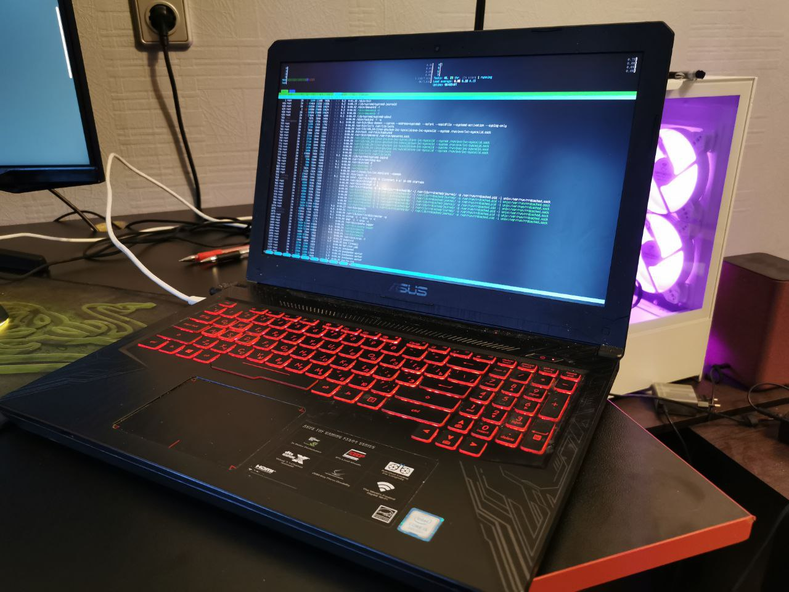

# Как я стал учиться на DevOps'а

Профессия разработчика мне стала приносить больше негативных эмоций и перестала 
привлекать. Причин этому множество, но речь не об этом. Последние несколько месяцев свободное время посвящалось больше работе операционных систем и гипервизоров, инструментам мониторинга и контейниризации. Так к январю 2024 года я решил для себя, что нужно сменить профессию на то, что лежит на данных момент ближе к моей душе, а именно в сторону DevOps. 

Почему именно DevOps? На данный момент мне сложно сказать, что именно представляет из себя данная профессия. Будучи разработчиком я взаимодействовал с разными DevOps'ами в разных по масштабу компаниях и их  обязанности широко варьировались: кто-то отвечал лишь за CI/CD и мониторинг, другие же были и DBOps'ами и в целом отвечали за инфраструктуру. Если же обратиться к Википедии, то увидим следующее определение:

```
DevOps (акроним от англ. development & operations) — методология автоматизации технологических процессов сборки, настройки и развёртывания программного обеспечения. Методология предполагает активное взаимодействие специалистов по разработке со специалистами по информационно-технологическому обслуживанию и взаимную интеграцию их  технологических процессов друг в друга для обеспечения высокого качества программного продукта. Предназначена для эффективной организации создания и обновления программных продуктов и услуг. Основана на идее тесной взаимозависимости создания продукта и эксплуатации программного обеспечения, которая прививается команде как культура создания продукта.
```

Несмотря на неопределенность, нарратив данной методологии мне близок - я нередко писал docker файлы и docker-compose совместно с баш-скриптами, чтобы упростить локальную разработку и тестирование, что уже напоминает этап в CI/CD. Разобраться, как приложение, например Postgres, взаимодействует с операционной системой под конец рабочего дня для меня является нормой. Проще говоря - данное направление меня всегда интересовало.

## Нужен план


Прежде чем приступить к составлению плана, я проконсультировался с DevOps'ами, получил полезные ресурсы, рекомендации и общий маршрут изучения стэка.Получлось следующее:
- Сети
- Linux
- Troubleshooting
- CI/CD gitlab/github actions, Git Flow
- Infrastructure as Code (IaC) Terraform
- Configuration Management - Ansible
- Any top 3 Cloud (AWS, Azure, GCP) or Yandex
- Containers / Docker / Docker-compose
- Kubernetes
- Observability: Tracing, Logs, Metrics
- Proxy servers (Nginx)
- Databases is a plus(postgresql clickhouse Redis for example)
- Queues and Message brokers 
- Working with secrets

В добавок записался на курс в Яндексе, который начнется в марте, чтобы пообщаться побольше с менторами и набраться опыта, да и какое-никакое портфолио будет. Несмотря на то, что изучение инструментария начнется в марте, февраль же решил посвятить Linux, сетям и виртуальным машинам. Не сказать, что с этими темами я вообще не знаком, но все же не хотелось бы, чтобы с ними возникли проблемы во время обучения.

## Двинули!

### Операционные системы

Думаю, что нет причин не изучать Linux. С ним я познакомился на первом курсе. Тогда я не понимал, чем же он так нравится разработчикам и как можно работать со всем через терминал? Мое отношение к данному семейству ОС изменилось, когда столкнулся с ним будучи php джуном. Просмотреть логи? awk и grep в помощь! Выгрузить большой объем данных, с которым не справляется desktop приложение на винде? Воспользуйся консолью и соответствующей командой! Автоматизировать рутинную работу? bash - самое то! Короче говоря, пушечка.

За февраль покопался в баше, углубился в работу с девайсами, практиковался с файловой системой, маунтами и вольюмами. Что занимательно, то из всего больше всего мне пригодилось на данный момент навык добавить дополнительный жесткий диск к Linux. Нет, у меня не имеется под рукой несколько лишний жестких дисков. Все дело в виртуальных машинах - обычно при их создании устанавливаю фиксированный размер как основной, так и внешней памяти. Последнюю же зачастую не хватает, а изменить тип виртуального жесткого диска нельзя. Тут на помощь и приходит маунт - достаточно создать отдельный виртуальный диск и прицепить его к виртуалке. 


<small class="small-text">Хочу такую майку</small>

Остального понемногу. Пока у меня нет постоянно работающего приложения, которое активно и логи выбрасывает, и ресурсы использует, что-то интересное не могу написать.

### Сети

Я часто ловил себя на мысли, что в чатиках DevOps'ах нередко поднимают вопросы по работе VPN, DNS, FTP и т.п., в которых много чего я не знаю, много непонятных мне проблем и, что более важное, нет идей, как их решать (несмотря на то, что тогда я был разработчиком, мне все же было интересно разобраться с этим). Так почему бы не закрыть пробел знаний?  


<small class="small-text"> </small>

Есть замечательный [курс CCNA](https://youtube.com/playlist?list=PLxbwE86jKRgMpuZuLBivzlM8s2Dk5lXBQ&si=WOaPet2GQ83I-5dH) на ютубе, по которому изучаю сети, плюс учебники. За 20 дней объединять сеть из нескольких локальных, прописывать айпи-адреса и маршурты, разделять сеть на подсети и устанавливать виртуальные локальные сети не составляет для меня труда. Практикуюсь в Cisco Packet Tracer. Из всего курса пока пропускаю темы касательно практики работы с протоколами по типу STP,RSTP, OSPF и т.п, которые нужны для организации сети в больших компаниях - уж очень мала вероятность, что буду заниматься этим. Но есть темы, которые мне пригодились - например,  разделение виртуальных машин по VLAN'ам или разбиение сети на подсети, тем самым снизив нагрузку на сеть.

После месяца такого изучения, почти все настройки роутера для меня понятны, а настроить локальные сети под себя не составляет труда (локальные сети, т.к. коммутатора у меня нет, а все виртуальные машины подсоединены напрямую к роутеру).

### Виртуальные машины

На первой работе в качестве основной ОС была винда, с которой не редко возникали проблемы, связанные с Docker desktop (а он использовался очень часто), да и разработка была неудобной - часто нужно было просмотреть логи, сравнить файлы, много рутиной работы. Была замена Linux в виде WSL, но это не решало всех проблем. Мне посоветовали попробовать поставить виртуальную машину. Я впервые услышал о такой возможности установки поверх работающей винды другой ОС, что и соблазнило меня. Так и познакомился с HyperV - в тот же день установил его на рабочий компьютер, накатил Ubuntu и перенес все рабочие проекты. Работать стало в разы проще. Главной особенностью была возможность сохранить снапшот виртуалки, которую мог запустить не только в офисе, но и дома. С тех пор виртуальными машинами стал пользоваться регулярно.

Поскольку многие датацентры крутят виртуалки, мне захотелось попробовать сделать что-то свое. Для этого починил старый ноутбук и накатил ProxMox. 


<small class="small-text">Старый ноут борозды не испортит</small>


Правда с подключение к интернету была проблема, так как единственный кабель интернета от роутера шел на ПК, а драйверов для работы с Wifi не было. Пришлось качать бинарники нужных драйверов на флешку, монтировать ее, устанавливать и настраивать доступ к интернету руками. Оказалось все намного проще, чем ожидалось: поставил драйвера, прописал адреса и маршруты, затем поработал с network конфигами и вуа-ля, все готово. Курсы по CCNA не прошли даром :)

Во время ознакомления с ProxMox, поставил debian и винду. К debian'у подключился по ssh, а к винде по rdp, но все это было в рамках моей локальной приватной сети. Чтобы иметь возможность подключиться к своим виртуалкам вне моей сети, я пробросил порты в настройках роутера. В целом есть идея организовать рабочее пространство в своем "облаке", которое будет крутиться на сервере дома. Для выполнения задач достаточно будет настроить ssh и поставить vim с плагинами. 

## Что в итоге

Февраль прошел больше в виде подготовки к непосредственному стеку, так как мне не хотелось тратить время на базовые вещи во время учебы. Да и работу никто не отменял.
Цель подготовки своей инфраструктуры проста донельзя: я где-то должен буду практиковать полученные навыки в работе с инструментами. Поставить свой гитлаб раннер. Мониторить приложения и сервера. Автоматизировать рутинную работу. Да и познакомить лицо с как можно бОльшим количеством граблей стоит именно на своем датацентре.


<small class="small-text">Куда же без них</small>

Думаю, что к следующему посту смогу поделиться мыслями по работе с каким-нибудь из инструментов. Ну а пока это всё :)